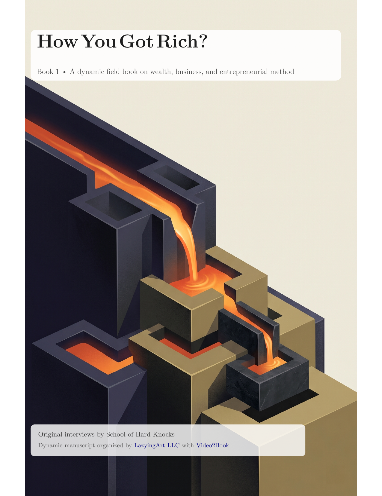
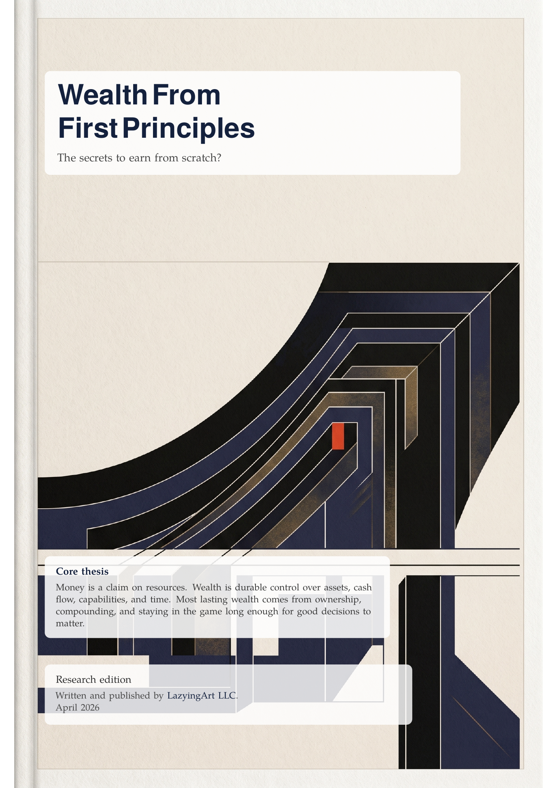
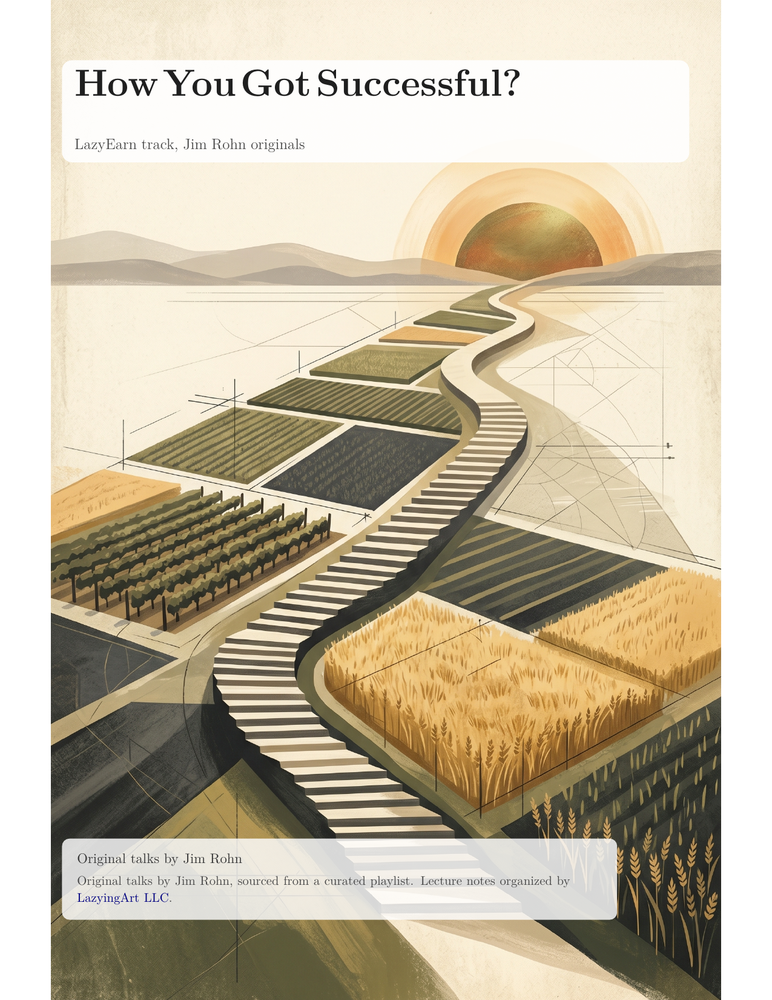
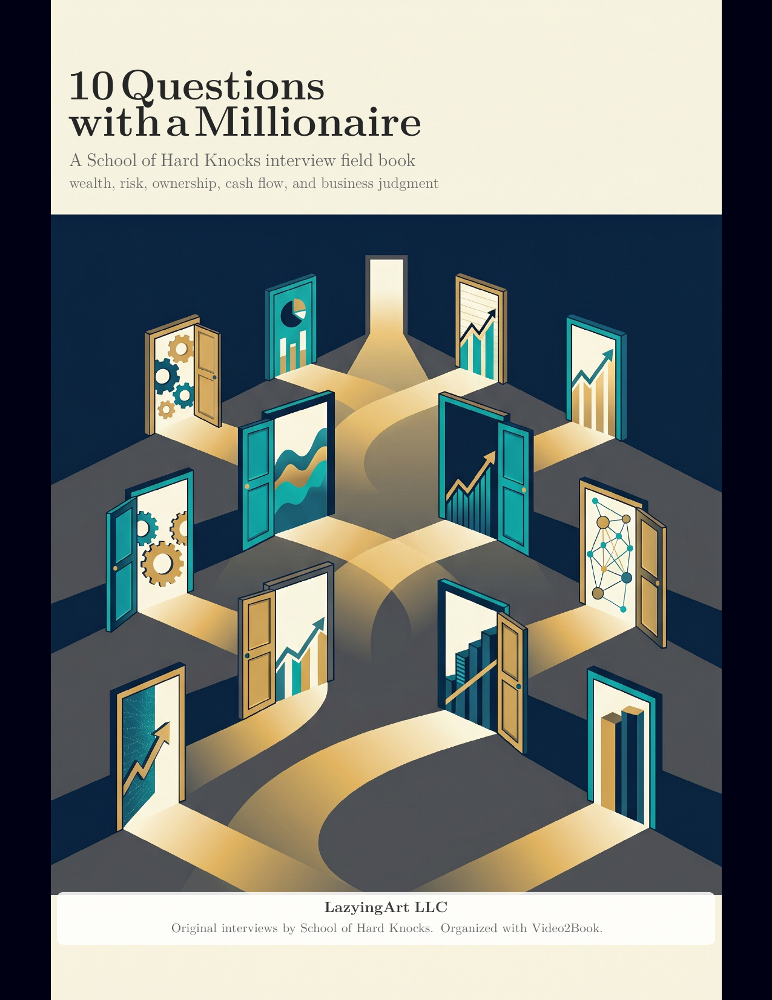
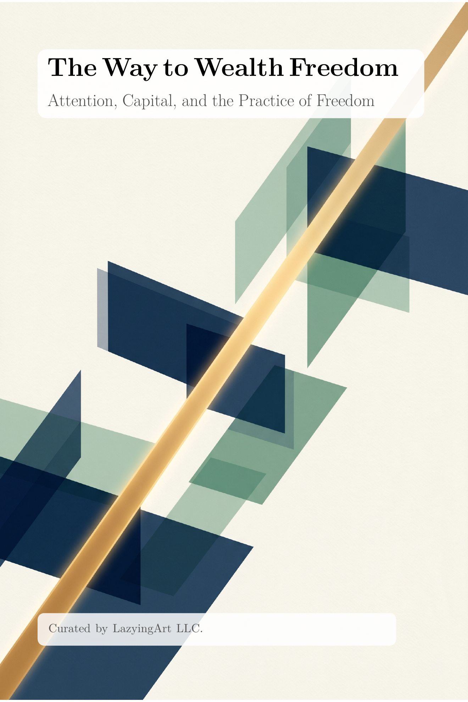
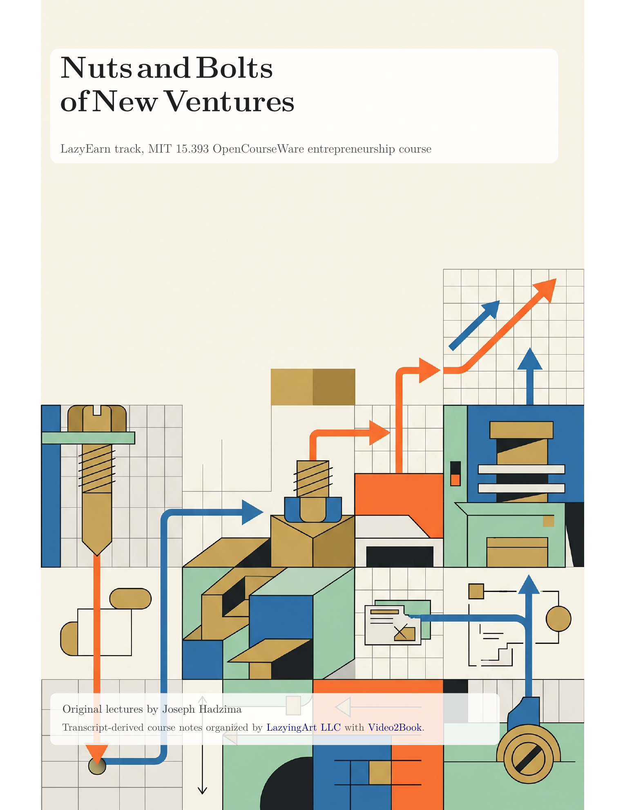
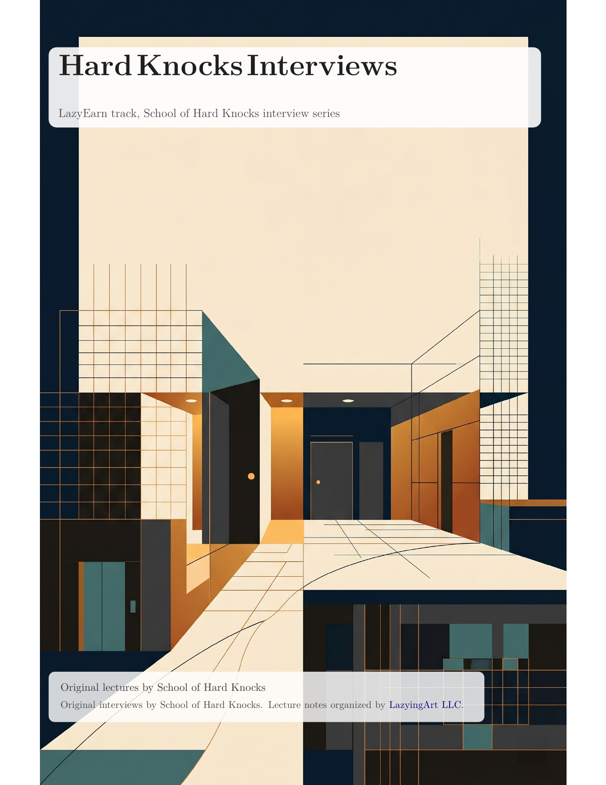
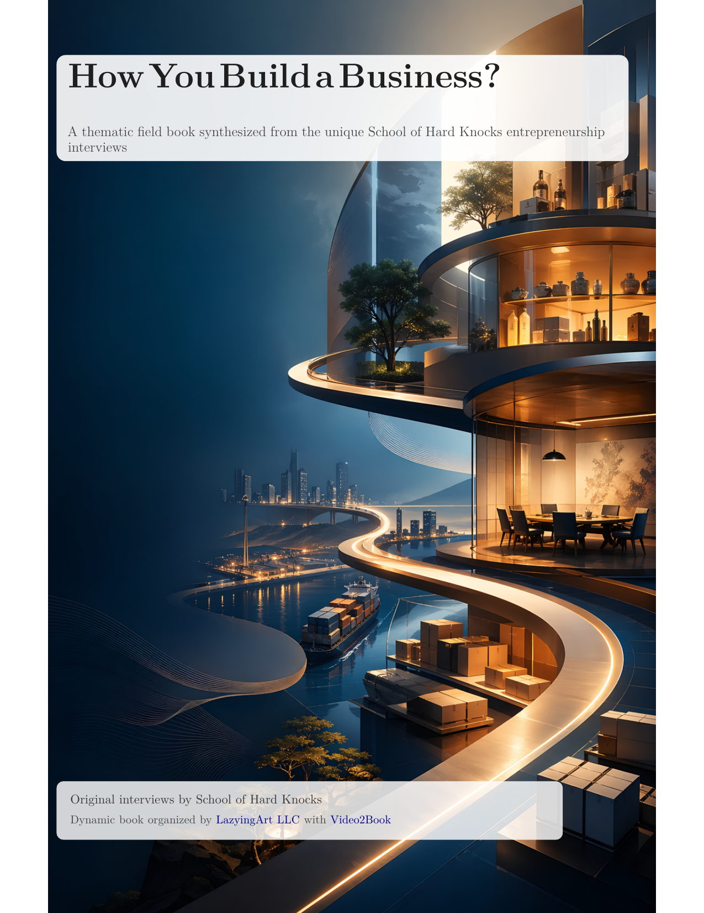
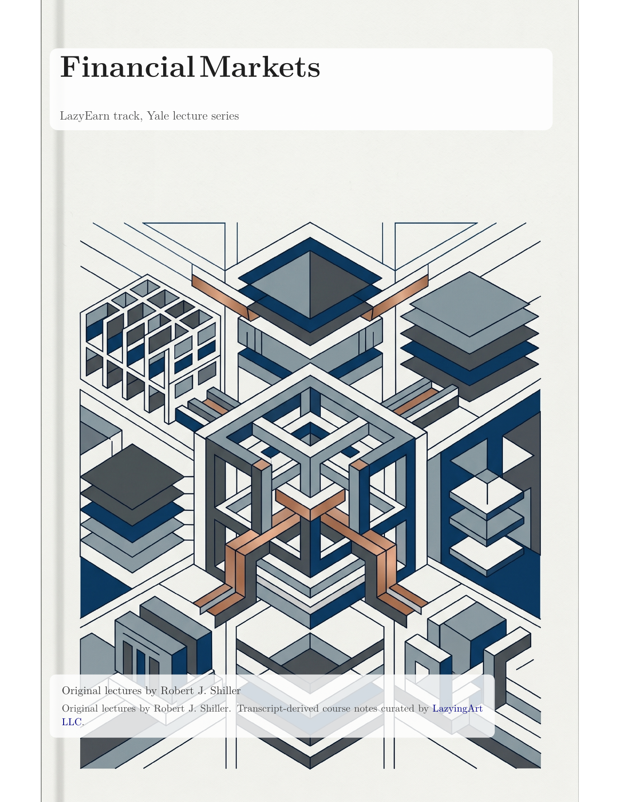

[English](README.md) · [العربية](i18n/README.ar.md) · [Español](i18n/README.es.md) · [Français](i18n/README.fr.md) · [日本語](i18n/README.ja.md) · [한국어](i18n/README.ko.md) · [Tiếng Việt](i18n/README.vi.md) · [中文 (简体)](i18n/README.zh-Hans.md) · [中文（繁體）](i18n/README.zh-Hant.md) · [Deutsch](i18n/README.de.md) · [Русский](i18n/README.ru.md)

[](https://github.com/lachlanchen/lachlanchen/blob/main/figs/banner.png)

Language options: English plus translated variants under `i18n/` (work in progress; some variants may lag the latest English research updates).

Localization scope split (synced for this round):

- Runtime website locales in `docs/translations.json`: `9` (`en`, `zh-Hant`, `zh-Hans`, `ja`, `ko`, `vi`, `ar`, `fr`, `es`).
- Translated README variants in `i18n/`: `10` (`ar`, `es`, `fr`, `ja`, `ko`, `vi`, `zh-Hans`, `zh-Hant`, `de`, `ru`) plus English source README.

# LazyEarn — The secrets to earn from scratch?

[](https://earn.lazying.art)
[](https://github.com/lachlanchen/LazyEarn)
[](https://pages.github.com/)
[](https://github.com/sponsors/lachlanchen)
[](#overview)
[](#configuration)
[](#overview)

## 📕 Flagship book

<p align="center">
  <a href="https://earn.lazying.art/howyougotrich/">
    
  </a>
</p>

<p align="center">
  <strong>How You Got Rich</strong><br>
  <em>From Abundance to Fulfillment and Contentment</em><br><br>
  <a href="https://earn.lazying.art/howyougotrich/">Read the native web book</a> ·
  <a href="https://github.com/lachlanchen/HowYouGotRich/blob/main/editions/how-you-got-rich.pdf">Full-size PDF</a> ·
  <a href="https://github.com/lachlanchen/HowYouGotRich/blob/main/editions/how-you-got-rich-pocket-1.2x.pdf">Pocket 1.2x PDF</a> ·
  <a href="https://github.com/lachlanchen/HowYouGotRich">Book repository</a>
</p>

## 🖼️ Wealth research shelf

This shelf is mirrored in the repo at [all_notes/wealth-research](all_notes/wealth-research) and synced to the local LazyingArtBooks `wealth-research` shelf.

**How You Got Rich** turns all 135 School of Hard Knocks interviews into one
source-traceable inquiry into abundance, fulfillment, contentment, and
financial freedom.

[Book source, editions, and contribution guide](https://github.com/lachlanchen/HowYouGotRich)
are maintained in a focused publication repository.

| Wealth from first principles | How You Got Rich | How You Got Successful? | How You Got Happiness? |
| --- | --- | --- | --- |
| [](https://earn.lazying.art/pdf-viewer.html#wealth-from-first-principles) | [](https://earn.lazying.art/pdf-viewer.html#how-you-got-rich) | [](https://earn.lazying.art/pdf-viewer.html#how-you-got-successful) | [](https://earn.lazying.art/pdf-viewer.html#how-you-got-happiness) |
| [PDF](https://earn.lazying.art/pdf-viewer.html#wealth-from-first-principles) · [Pocket 1.0x](https://earn.lazying.art/pdf-viewer.html#wealth-from-first-principles-pocket-1-0x) · [Pocket 1.2x](https://earn.lazying.art/pdf-viewer.html#wealth-from-first-principles-pocket-1-2x) · [Markdown](investment/wealth-from-first-principles.md) | [PDF](https://earn.lazying.art/pdf-viewer.html#how-you-got-rich) · [Pocket 1.2x](https://earn.lazying.art/pdf-viewer.html#how-you-got-rich-pocket-1-2x) | [PDF](https://earn.lazying.art/pdf-viewer.html#how-you-got-successful) · [Pocket 1.0x](https://earn.lazying.art/pdf-viewer.html#how-you-got-successful-pocket-1-0x) · [Pocket 1.2x](https://earn.lazying.art/pdf-viewer.html#how-you-got-successful-pocket-1-2x) | [PDF](https://earn.lazying.art/pdf-viewer.html#how-you-got-happiness) · [Pocket 1.2x](https://earn.lazying.art/pdf-viewer.html#how-you-got-happiness-pocket-1-2x) · [Course notes](https://earn.lazying.art/pdf-viewer.html#how-you-got-happiness-course-notes) |
| **10 Questions With a Millionaire** | **The Way to Wealth Freedom** | **MIT Nuts and Bolts of New Ventures** | **Hard Knocks Interviews** |
| [](https://earn.lazying.art/pdf-viewer.html#10-questions-with-a-millionaire) | [](https://earn.lazying.art/pdf-viewer.html#the-way-to-wealth-freedom-notes) | [](https://earn.lazying.art/pdf-viewer.html#mit-nuts-and-bolts-of-new-ventures) | [](https://earn.lazying.art/pdf-viewer.html#hard-knocks-interviews) |
| [PDF](https://earn.lazying.art/pdf-viewer.html#10-questions-with-a-millionaire) · [Pocket 1.2x](https://earn.lazying.art/pdf-viewer.html#10-questions-with-a-millionaire-pocket-1-2x) · [Dynamic PDF](https://earn.lazying.art/pdf-viewer.html#ten-questions-that-build-wealth) · [Dynamic pocket](https://earn.lazying.art/pdf-viewer.html#ten-questions-that-build-wealth-pocket-1-2x) | [PDF](https://earn.lazying.art/pdf-viewer.html#the-way-to-wealth-freedom-notes) · [Pocket 1.2x](https://earn.lazying.art/pdf-viewer.html#the-way-to-wealth-freedom-notes-pocket-1-2x) · [Source notes](materials/the-way-to-wealth-freedom-notes/README.md) | [Full PDF](https://earn.lazying.art/pdf-viewer.html#mit-nuts-and-bolts-of-new-ventures) · [Pocket 1.2x](https://earn.lazying.art/pdf-viewer.html#mit-nuts-and-bolts-of-new-ventures-pocket-1-2x) | [PDF](https://earn.lazying.art/pdf-viewer.html#hard-knocks-interviews) · [Pocket 1.2x](https://earn.lazying.art/pdf-viewer.html#hard-knocks-interviews-pocket-1-2x) |
| **Entrepreneurship** | **How You Build a Business?** | **Yale Financial Markets notes** |  |
| [](https://earn.lazying.art/pdf-viewer.html#entrepreneurship) | [](https://earn.lazying.art/pdf-viewer.html#how-you-build-a-business) | [](https://earn.lazying.art/pdf-viewer.html#yale-financial-markets-notes) |  |
| [PDF](https://earn.lazying.art/pdf-viewer.html#entrepreneurship) · [Pocket 1.2x](https://earn.lazying.art/pdf-viewer.html#entrepreneurship-pocket-1-2x) | [PDF](https://earn.lazying.art/pdf-viewer.html#how-you-build-a-business) · [Pocket 1.2x](https://earn.lazying.art/pdf-viewer.html#how-you-build-a-business-pocket-1-2x) | [Full PDF](https://earn.lazying.art/pdf-viewer.html#yale-financial-markets-notes) · [Pocket 1.0x](https://earn.lazying.art/pdf-viewer.html#yale-financial-markets-pocket-1-0x) · [Pocket 1.2x](https://earn.lazying.art/pdf-viewer.html#yale-financial-markets-pocket-1-2x) |  |

Last synced to mission cycle: **cycle_025** (`2026-04-06`).

Earn.lazying.art is a source-aware, mechanism-first repository for people building clear mental models of money, wealth, ownership, and long-horizon financial resilience.

The repository keeps a single claim pipeline through shared artifacts:

- `investment/wealth-from-first-principles.md` for readable explanation
- `investment_pdfs/wealth-from-first-principles/wealth-from-first-principles.tex` for reference-grade structure
- `investment_pdfs/wealth-from-first-principles/wealth-from-first-principles.pdf` for publishable output
- `docs/index.html` + `docs/translations.json` for public discovery and route wiring
- `references/wealth-engine/` for operating memory (`mission`, methods, source ledger, and side-products)

The public language layer still includes **Lazy Money**, **Lazy Earn**, and **Earn From Scratch**, while core content emphasizes evidence, mechanism, and decision quality.

> _“The secrets to earn from scratch?”_ — LazyEarn slogan

## 🏛️ Featured course publications

The completed course-note editions are published from repo-root shelves:

- [Publication shelf](yale-financial-markets-publication/README.md)
- [Full course PDF](https://earn.lazying.art/pdf-viewer.html#yale-financial-markets-notes)
- [Pocket-size PDF 1.0x](https://earn.lazying.art/pdf-viewer.html#yale-financial-markets-pocket-1-0x)
- [Pocket-size PDF 1.2x](https://earn.lazying.art/pdf-viewer.html#yale-financial-markets-pocket-1-2x)
- [Website viewer](https://earn.lazying.art/pdf-viewer.html#yale-financial-markets-notes)
- [MIT New Ventures shelf](mit-nuts-and-bolts-of-new-ventures-publication/README.md)
- [MIT New Ventures full PDF](https://earn.lazying.art/pdf-viewer.html#mit-nuts-and-bolts-of-new-ventures)
- [MIT New Ventures pocket-size PDF 1.2x](https://earn.lazying.art/pdf-viewer.html#mit-nuts-and-bolts-of-new-ventures-pocket-1-2x)
- [MIT New Ventures website viewer](https://earn.lazying.art/pdf-viewer.html#mit-nuts-and-bolts-of-new-ventures)
- [Entrepreneurship shelf](entrepreneurship-publication/README.md)
- [Entrepreneurship full PDF](https://earn.lazying.art/pdf-viewer.html#entrepreneurship)
- [Entrepreneurship pocket-size PDF 1.2x](https://earn.lazying.art/pdf-viewer.html#entrepreneurship-pocket-1-2x)
- [How You Build a Business? dynamic PDF](https://earn.lazying.art/pdf-viewer.html#how-you-build-a-business)
- [How You Build a Business? pocket-size PDF 1.2x](https://earn.lazying.art/pdf-viewer.html#how-you-build-a-business-pocket-1-2x)
- [How You Got Happiness? shelf](how-you-got-happiness-publication/README.md)
- [How You Got Happiness? PDF](https://earn.lazying.art/pdf-viewer.html#how-you-got-happiness)
- [How You Got Happiness? pocket-size PDF 1.2x](https://earn.lazying.art/pdf-viewer.html#how-you-got-happiness-pocket-1-2x)
- [10 Questions With a Millionaire shelf](10-questions-with-a-millionaire-publication/README.md)
- [10 Questions With a Millionaire PDF](https://earn.lazying.art/pdf-viewer.html#10-questions-with-a-millionaire)
- [10 Questions With a Millionaire pocket-size PDF 1.2x](https://earn.lazying.art/pdf-viewer.html#10-questions-with-a-millionaire-pocket-1-2x)
- [Ten Questions That Build Wealth dynamic PDF](https://earn.lazying.art/pdf-viewer.html#ten-questions-that-build-wealth)
- [Ten Questions That Build Wealth pocket-size PDF 1.2x](https://earn.lazying.art/pdf-viewer.html#ten-questions-that-build-wealth-pocket-1-2x)

These publications contain root-level covers, full-course PDFs, and pocket-size editions for 10-inch e-ink or iPad reading. Yale also includes one PDF per lecture for Robert J. Shiller's full sequence; MIT New Ventures publishes the consolidated Joseph Hadzima course edition; Entrepreneurship publishes both the lecture-by-lecture field book and the dynamic `How You Build a Business?` synthesis with separate covers; How You Got Happiness? publishes both the nonlinear Krishnamurti book and the lecture-by-lecture source notes; 10 Questions With a Millionaire publishes the School of Hard Knocks millionaire-interview notes and the dynamic `Ten Questions That Build Wealth` variant with NanoBanana covers.

## 🧭 Mission and operating method

LazyEarn is a source-aware, mechanism-first pipeline for money and wealth education. It keeps four things in one loop:

1. A clear mission model (money, wealth, ownership, and durable control).
2. Reusable methods and side-products in `references/wealth-engine/knowledge/` (`methods`, `question-bank`, `source-ledger`, `chapter-evidence-map`, `next-tasks`).
3. A compact evidence contract (`question-bank` -> `methods` -> `source-ledger` -> `chapter-evidence-map`) that keeps each claim linked to falsifiers, source states, and decision use.
4. A clear reader-facing delivery path (`investment/` -> `investment_pdfs/` -> `docs/index.html`/`script.js`/`translations.json`) that keeps claim sequencing and route-step messaging consistent across surfaces.
5. A simple consistency check each round: if one claim moves in `question-bank.md`, the same chain must be updated in `source-ledger.tsv`, `chapter-evidence-map.md`, `wealth-from-first-principles.md`, `wealth-from-first-principles.tex`, and reader-facing route descriptors.

When a new mechanism or source is added, evidence and delivery should move in this order:

- Validate method/evidence in `references/wealth-engine/knowledge/methods.md` and `references/wealth-engine/knowledge/question-bank.md`.
- Pull or update evidence rows in `references/wealth-engine/knowledge/source-ledger.tsv`.
- Reflect the mechanism in `investment/wealth-from-first-principles.md`.
- Mirror it in `investment_pdfs/wealth-from-first-principles/wealth-from-first-principles.tex`.
- Keep public exposure aligned in `docs/index.html`, `docs/script.js`, and `docs/translations.json`.

### Current output chain

For each chapter-facing update, the repository keeps this chain:

Markdown brief (`investment/...`) -> LaTeX source (`investment_pdfs/.../wealth-from-first-principles.tex`) ->  
repo PDF (`investment_pdfs/wealth-from-first-principles/wealth-from-first-principles.pdf`) ->  
site PDF (`docs/investment_pdfs/wealth-from-first-principles/wealth-from-first-principles.pdf`) ->  
reader routes (`docs/index.html` + `docs/script.js` + `docs/translations.json`).

### Evidence contract for readers

| Artifact | Role in the reader-facing contract |
| --- | --- |
| `knowledge/question-bank.md` | Defines the top mechanism questions (`U`-level priorities, distinction set, and priority order). |
| `knowledge/methods.md` | Encodes claim gates (`SQ-5`), falsifier logic, and practical decision preconditions. |
| `knowledge/source-ledger.tsv` | Tracks canonical source state, method-to-source traceability, and explicit `must_not_conflate` fields. |
| `knowledge/chapter-evidence-map.md` | Keeps chapter-level claim bundles mapped to question IDs, source states, and decision consequences. |
| `knowledge/side-products.md` | Converts high-impact claims into practical reader prompts, checklists, and execution rules. |

### Current release health (README-visible)

- `README.md` is synced to `cycle_025`, with the current evidence and delivery contract now explicitly documented.
- `investment/wealth-from-first-principles.md` and `investment_pdfs/wealth-from-first-principles/wealth-from-first-principles.tex` are the canonical money/wealth thesis pair to keep synchronized.
- `docs/index.html`, `docs/script.js`, and `docs/translations.json` still reflect `Cycle_024` route-copy in `research.point9`, `research.routeIntro`, and `research.routeStep*`; this is expected to be resolved in the next `website_sync` round.

### Cycle_025 operating focus

- Keep the repository's money/wealth mission language and operational chain aligned at the README layer while chapter and source edits are still transitioning from round_05 side-products into route-facing handoff.
- Confirm the active focus remains:  
  - `investment/wealth-from-first-principles.md` and `investment_pdfs/wealth-from-first-principles/wealth-from-first-principles.tex` are synchronized for core mechanism updates.  
  - `knowledge/question-bank.md` is using `U118`–`U125` as the unresolved core lens set and `knowledge/methods.md` is advancing `FML-6`.  
  - `knowledge/side-products.md` and seeded checklists keep the `first-mile-transmission-checklist` and `30D-SW` pathway explicit for read-time execution.
- Track route-sequencing parity even when labels lag: the chapter path is unchanged (`9.10` → `9.10.1` → `9.11` → `9.11.1` → `HCT-6` → `9.11.4` → `9.11.5` → `9.11.6`/`9.11.7` → `30D-SW`) and this sequence should remain identical across English and at least one additional locale when website copy is refreshed.

## 🗂️ Snapshot map

| Location | Purpose | Why it matters |
| --- | --- | --- |
| `docs/` | Production website source (`index.html`, `styles.css`, `script.js`) | Public site that powers `earn.lazying.art` |
| `investment/` | Markdown research briefs | Canonical source of truth for money, wealth, and investing research |
| `investment_pdfs/` | Compiled LaTeX/PDF artifacts | Shareable portfolio-grade outputs |
| `yale-financial-markets-publication/` | Root-level Yale course publication shelf | Direct access to the full course PDF and per-lecture PDFs |
| `references/wealth-engine/` | Mission, source map, question bank, methods, and round logs | Research memory and operating layer for continuous refinement |
| `scripts/wealth-refinery.sh` | Round driver entrypoint | Keeps round execution consistent outside Codex git actions |
| `figs/` | Brand assets | Visual identity and banner references |
| `i18n/` | Translated README files | Multilingual repository entry points |
| `references/wealth-engine/knowledge/historical-transmission-countercase.md` | Historical constrained-vs-countercase ledger | Supports chapter 9 mechanism transfer rules and reversibility checks |
| `references/wealth-engine/knowledge/chapter-evidence-map.md` | Chapter-level claim and evidence map | Keeps high-impact chapter claims tied to questions, source state, and decision implications |

## 🧭 Overview

LazyEarn is a static GitHub Pages-oriented project with two major parts:

1. A production frontend in `docs/` (HTML, CSS, vanilla JS, i18n strings, inline PDF viewer pages).
2. A research pipeline using Markdown source briefs in `investment/` and compiled LaTeX/PDF artifacts in `investment_pdfs/` (also mirrored to `docs/investment_pdfs/` for web delivery).

Primary production domain (from `docs/CNAME`): `earn.lazying.art`.

### Cycle_023 operating focus

- Keep the money-and-wealth outputs synchronized across markdown (`investment/wealth-from-first-principles.md`), TeX (`investment_pdfs/wealth-from-first-principles/wealth-from-first-principles.tex`), and website route surfaces (`docs/index.html`, `docs/script.js`, `docs/translations.json`).
- Record reader-facing evidence discipline in the side-product layer:
  - `knowledge/methods.md` now includes `CX-7` portability-gates,
  - `knowledge/side-products.md` tracks the cross-jurisdiction checklist with source/falsifier constraints,
  - `references/wealth-engine/cycles/cycle_023/round_05_side_products` stores seed rows and process notes.
- Consolidate Chapter 9 transmission around:
  - `9.10` constraint-first lens,
  - `9.11` money/debt/constraint decision map,
  - `9.11.6` policy continuity vs ownership-access checks.
- Confirm the route card and method list in README map to the same Chapter 9 sequence shown on the website (`research.routeStep1` to `research.routeStep9`) before each cross-cycle handoff.

### Cycle_024 operating focus

- Keep this round documentation-first: make sure README and side-product references stay synchronized before any book or website wording claims move to new cycle labels.
- Expose the new cycle frontier from `references/wealth-engine/next-tasks.md`:
  - `U110`-`U117` clarification in the question bank,
  - `knowledge/wealth-time-control-checklist.md` as a Chapter 4 bridge to `U112` and `U114`,
  - explicit `falsifier`/`must_not_conflate` fields before applying claims in chapter-facing pathways.
- Keep `knowledge/side-products.md`, `knowledge/chapter-evidence-map.md`, and `references/wealth-engine/mission.md` consistent for method-to-reader transfer.
- Confirm this front-page README section points to the same Chapter 9 reader path that `docs` currently shows (`research.routeStep1` to `research.routeStep9`) until the next dedicated website-sync pass updates cycle text in all locales.
- After the round, this section should be rechecked so README and website route strings are aligned on the same cycle label and same `30D-SW` framing before any book-facing claims escalate.

### Cycle_021 operating focus

- Confirm README and website-facing core research messaging are aligned to the active cycle.
- Keep the reader route and evidence-output map centered on the Chapter 9 historical mechanism chain:
  - `9.10` through `9.11.5`
  - `HCT-6` constrained-vs-countercase checks
  - `CHM-6` evidence mapping
  - `30D-SW` constrained-wealth execution checks
- Keep `investment/wealth-from-first-principles.md`, `investment_pdfs/wealth-from-first-principles/wealth-from-first-principles.tex`, and `investment_pdfs/wealth-from-first-principles/wealth-from-first-principles.pdf` in cycle-sync with website routes.
- No markdown/TeX/PDF content edits were made in this readme-only sync round.

### Cycle_020 operating focus

- Consolidate documentation after the `9.11.5` historical mechanism work introduced in this cycle.
- Keep the readme and `references/wealth-engine/next-tasks.md` aligned on the current active questions and evidence-readiness tasks (`U80`+ block, `U86` comparator follow-up).
- Confirm website-facing cycle messaging remains coherent in the next `website_sync` round.
- No markdown/TeX/PDF content edits were made in this readme-only sync round.

### Cycle_019 operating focus

- Keep this round aligned to documentation-facing sync quality across mission, methods, and output surfaces.
- Make the README explicitly show the current cycle, the active method artifacts, and the book/output chain.
- Confirm website research-copy and routing language remain consistent with what is currently documented in this README.
- No markdown/TeX/PDF content edits were made in this readme-only sync round.

### Cycle_018 operating focus

- Keep this cycle focused on operational side-product maturity in `references/wealth-engine/` so chapter-level decisions are easier to execute repeatedly.
- Keep side-products and methods synchronized for chapter 9-to-action translation:
  - `references/wealth-engine/knowledge/methods.md` (`30D-SW`),
  - `references/wealth-engine/knowledge/side-products.md`,
  - `references/wealth-engine/knowledge/constrained-wealth-30-day-sprint.md`.
- Keep README claims tied to explicit cycle state and avoid implying chapter/PDF structural changes that are not yet made.
- Research-cycle language in `docs/index.html` is now aligned to `cycle_018`, including the 30D-SW constrained-wealth execution framing and Chapter 9 route gating.
- Practical purpose:
  - convert mechanism insights into timed, reversible action routines;
  - keep readers aligned between evidence framing, method gates, and operational study tracks.

### Cycle_017 operating focus

- Keep mechanism design and evidence discipline aligned across:
  - `investment/wealth-from-first-principles.md`
  - `investment_pdfs/wealth-from-first-principles/wealth-from-first-principles.tex`
  - `references/wealth-engine/knowledge/` side assets
- Keep chapter 9 mechanism work synchronized across markdown, TeX, and route-ready summaries.
- Apply chapter-level evidence mapping before each reader-facing handoff.
- Use `CHM-6` to keep chapter-level claims linked to questions, sources, and decision implications in each major edit.
- Keep README language, method IDs, and route guidance coherent with website copy.

## 🧭 Vision and philosophy

- **Mechanism before systems**: define money, ownership, and control channels before selecting tactics.
- **Evidence before recommendation**: every claim is connected to explicit source quality and interpretation boundaries.
- **Actionable decision framing**: each section should separate temporary signal from durable control.

## ✨ Features

- Public landing experience aligned with practical wealth-education pathways.
- Idea Playground generator for randomized monetization experiments.
- Runtime i18n system powered by `docs/translations.json` with English fallback.
- Language persistence key: `lazyEarnLang`.
- Theme persistence key: `lazyearn_theme`.
- Research showcase with direct PDF download, inline viewer routes, and Markdown source links.
- A primary money-and-wealth field guide covering money creation, ownership, compounding, inequality, and practical wealth-building methods.
- Household stress and transmission guidance (standards, credit flow, debt burden, delinquency transitions, and resilience signals) synced into markdown and TeX guide surfaces.
- Revision-aware credit-and-capacity check guidance (revision risk, real-capacity signals, and throughput sequencing) synced into markdown and TeX guide surfaces.
- Liquidity-and-cycle clock guidance (H.4.1, H.8, NFCI, TIC, MTS, ECI, NBER) synced into markdown and TeX guide surfaces.
- Entry-and-property-price pulse guidance (BFS, BDS, BIS RPP/CPP/GLI, LPC, STEO) synced into markdown and TeX guide surfaces.
- Credit-access-and-burden bridge guidance (DDP, SCE Credit Access, CEX PUMD, SIPP, OECD debt rails) synced into markdown and TeX guide surfaces.
- Cadence-aware stress classification panel guidance (release-cadence integrity, charge-off and delinquency drift, access friction, and capacity concentration checks) synced into markdown and TeX guide surfaces.
- Money, debt, and physical-constraint decision map guidance (sovereign risk, access frictions, valuation, debt burden, and throughput sequencing) synced into markdown and TeX guide surfaces.
- A codex-driven wealth refinery loop with a question bank, methods playbook, side-product catalog, and source ledger.
- PDF viewer routing via hash/query for the published shelf.
- GitHub Pages-compatible static distribution with no build step for the website shell.

## 🧭 Reader pathways

- Start with `investment/wealth-from-first-principles.md`.
- Use `docs/index.html` → Research Drop for the same guide in HTML + PDF route form.
- Validate active methods and open follow-ups in:
  - `references/wealth-engine/knowledge/methods.md`
  - `references/wealth-engine/knowledge/chapter-evidence-map.md` (when present)
  - `references/wealth-engine/next-tasks.md`.

## 🧠 Why this repository exists

- Give a **mechanism-first, source-aware** education path for:
  - what money is,
  - how wealth is produced under physical and institutional constraints,
  - how ownership and leverage interact, and
  - how to avoid fragile conclusions by separating revision risk from durable signals.
- Keep three surfaces coherent as first-class artifacts:
  - `investment/wealth-from-first-principles.md` for readable argument and methods,
  - `investment_pdfs/wealth-from-first-principles/wealth-from-first-principles.tex` for reference-grade structure, and
  - `docs/index.html` + `docs/script.js` + `docs/translations.json` for discovery.
- Add one new mechanism-focused block every few cycles, then immediately align references, method IDs, and execution artifacts.

## 🧩 What’s inside the site

| Section               | Focus                                               | Energy                              |
| --------------------- | --------------------------------------------------- | ----------------------------------- |
| **Lazy Money Lab**    | How money can flow while you stay rested            | Stacked loops, not tasks            |
| **Lazy Earn Stack**   | Automation map, idea vault, and relaxation index    | Structured but calm                 |
| **Earn From Scratch** | Spark → craft → stretch for beginners               | Start from zero, skip grind culture |
| **Idea Playground**   | Interactive generator for new lazy-earn experiments | Tap to remix ideas                  |
| **Research Drop**     | Living shelf for investment-like briefs             | Long-form conviction                |

## 📈 Research vault

| What you get | Markdown | PDF |
| --- | --- | --- |
| **Wealth From First Principles** | A practical field guide to what money is, where it comes from, what wealth is, who can build it, why wealth gaps persist, and which books, courses, tutorials, datasets, and repositories are worth your time.
[`Open markdown`](https://github.com/lachlanchen/LazyEarn/blob/main/investment/wealth-from-first-principles.md) | [Open PDF](https://earn.lazying.art/pdf-viewer.html#wealth-from-first-principles) |
| **Yale Financial Markets Notes** | A published root-level course edition of Robert J. Shiller's lecture sequence, with one full-course PDF, one PDF per lecture, and a dedicated publication shelf README.
[`Open publication`](https://github.com/lachlanchen/LazyEarn/blob/main/yale-financial-markets-publication/README.md) | [Open PDF](https://earn.lazying.art/pdf-viewer.html#yale-financial-markets-notes) |
| **MIT Nuts and Bolts of New Ventures** | A published root-level course edition of Joseph Hadzima's MIT entrepreneurship sequence, with a full-course PDF, 1.2x pocket edition, generated cover, and dedicated publication shelf README.
[`Open publication`](https://github.com/lachlanchen/LazyEarn/blob/main/mit-nuts-and-bolts-of-new-ventures-publication/README.md) | [Open PDF](https://earn.lazying.art/pdf-viewer.html#mit-nuts-and-bolts-of-new-ventures) |

## 🔁 Book sync highlights (cycle_006)

- Added a new practical mechanism block in the main guide:
  - `9.5 Revision-aware credit-and-capacity check (quarterly)`.
- Synced the same mechanism into TeX:
  - `Revision-aware credit-and-capacity check (quarterly)`.
- Expanded official-source coverage in both book surfaces:
  - Federal Reserve `G.19`,
  - Fed FEDS note on `G.19` credit-union estimate revisions,
  - BEA Fixed Assets,
  - EIA Monthly Energy Review,
  - ECB Bank Lending Survey.
- Practical purpose:
  - avoid confusing statistical revisions with real regime shifts,
  - avoid treating nominal credit growth as durable wealth capacity.

## 🔁 Book sync highlights (cycle_007)

- Added a new practical mechanism block in the main guide:
  - `9.6 Liquidity-and-cycle clock (monthly and quarterly)`.
- Synced the same mechanism into TeX:
  - `Liquidity-and-cycle clock (monthly and quarterly)`.
- Expanded cycle-clock source coverage in both book surfaces:
  - Federal Reserve `H.4.1` and `H.8`,
  - Chicago Fed `NFCI`,
  - U.S. Treasury `TIC` and `MTS/FiscalData` rails,
  - BLS `ECI`,
  - NBER business-cycle chronology,
  - SEC Financial Statement and Notes Data Sets.
- Practical purpose:
  - separate liquidity provision from credit transmission,
  - separate valuation tailwinds from broad ownership access,
  - force mixed-cadence signals into one explicit timing workflow before leverage decisions.

## 🔁 Book sync highlights (cycle_008)

- Added a new practical mechanism block in the main guide:
  - `9.7 Entry-and-property-price pulse (monthly and quarterly)`.
- Synced the same mechanism into TeX:
  - `Entry-and-property-price pulse (monthly and quarterly)`.
- Expanded official-source coverage in both book surfaces:
  - U.S. Census `BFS` and `BDS` API rails,
  - BIS `RPP`, `CPP`, and `GLI`,
  - BLS `Productivity and Costs (LPC)`,
  - EIA `Short-Term Energy Outlook (STEO)`,
  - BEA `Open Data API`.
- Practical purpose:
  - separate entry momentum from entrant durability,
  - separate valuation moves from broad participation gains,
  - require liquidity and real-conversion context before leverage escalation.

## 🔁 Book sync highlights (cycle_009)

- Added a new practical mechanism block in the main guide:
  - `9.8 Credit-access and burden bridge (monthly and quarterly)`.
- Synced the same mechanism into TeX:
  - `Credit-access and burden bridge (monthly and quarterly)`.
- Expanded official-source coverage in both book surfaces:
  - Federal Reserve Data Download Program (`DDP`) and Fed announcements feed,
  - Federal Reserve Financial Accounts Guide (`FOF`) table-navigation rail,
  - New York Fed Survey of Consumer Expectations Credit Access Survey,
  - BLS Consumer Expenditure Survey Public Use Microdata (`CEX PUMD`),
  - U.S. Census Survey of Income and Program Participation (`SIPP`) datasets,
  - OECD household debt indicator rail.
- Practical purpose:
  - separate credit intent signals from realized household outcomes,
  - separate access tightening from burden tightening,
  - require a burden-and-durability cross-check before leverage escalation.

## 🔁 Book sync highlights (cycle_010)

- Added a new practical mechanism block in the main guide:
  - `9.9 Cadence-aware stress classification panel (monthly and quarterly)`.
- Synced the same mechanism into TeX:
  - `Cadence-aware stress classification panel (monthly and quarterly)`.
- Expanded official-source coverage in both book surfaces:
  - Federal Reserve Statistical Release Calendar + DDP announcements feed + OECD API guidance,
  - Federal Reserve Charge-Off and Delinquency release,
  - New York Fed SCE Credit Access + Federal Reserve SLOOS,
  - Federal Reserve `G.17` + `H.8` + `H.6`,
  - IMF `FSIC` + BIS `DSR`,
  - IRS SOI individual PUF + Federal Reserve `DFA` + `SCF`.
- Practical purpose:
  - prevent stale/fresh signal mixing in stress reads,
  - separate `access-fragile`, `capacity-fragile`, and `distribution-fragile` regimes before leverage changes,
  - require "as-known-on-date" checks before escalating ownership risk.

## 🔁 Book sync highlights (cycle_011)

- Added a new historical-method scaffold in the main guide:
  - `9.10 Constraint-first lens for money-growth episodes`.
- Synced the same constraint-first historical lens into TeX:
  - `Constraint-first lens for money-growth episodes`.
- Added a new case-construction method for historical evidence shaping:
  - `HC-5` (historical-case conversion) in `references/wealth-engine/knowledge/methods.md`
  - planned executable artifact `knowledge/historical-case-ledger.md` in `references/wealth-engine/knowledge/side-products.md`
- Practical purpose:
  - make historical episodes support decision questions (rather than remain narrative-only),
  - force mechanism/actor/scope-limit discipline for major cycles (`U46`-`U52`),
  - prepare a reusable ledger so future chapters can use one consistent historical evidence format.

## 🔁 Book sync highlights (cycle_012)

- Added a new practical mechanism block in the main guide:
  - `9.11 Money, debt, and physical constraints decision map`.
- Synced the same mechanism into TeX:
  - `Money, debt, and physical constraints decision map`.
- Expanded official-source coverage in both book surfaces:
  - IMF Fiscal Monitor debt and fiscal-space material,
  - UNCTAD debt and investment reports,
  - IEA World Energy Outlook + IEA Oil Market Report,
  - BIS Quarterly Review March 2026,
  - and existing burden/access rails (`BIS DSR` and `Fed DSR/FOR`) for durability checks.
- Practical purpose:
  - separate temporary liquidity or payment cushioning from durable ownership gains,
  - compare whether liquidity, access, valuation, and throughput channels lead first,
  - and mark irreversible risk channels before making allocation calls.

## 🔁 Book sync highlights (cycle_013)

- Added a companion historical mechanism test in the main guide:
  - `9.10.1 Historical mechanism test: Great Recession transmission (Dec 2007–Jun 2009)`.
- Synced the same mechanism into TeX in the corresponding section:
  - `9.10.1 Historical mechanism test: Great Recession transmission (Dec 2007--Jun 2009)`.
- Expanded source scaffolding in both markdown and TeX surfaces:
  - Federal Reserve History: Great Recession essays and bank-credit program timeline,
  - New York Fed archive speech and macro policy context tied to the transmission sequence.
- Added side-product readiness updates for cycle_013:
  - active `knowledge/study-paths.md` path artifact was introduced in the side-product catalog (`SP-6`),
  - next-follow-up tracks first-path publication and continuation-rules.
- Practical purpose:
  - separate crisis-era liquidity effects from durable owner-creation outcomes,
  - force readers to apply historical mechanism tests before interpreting current leverage and stress signals,
  - and make the next study sequence more action-oriented.

## 🔁 Book sync highlights (cycle_014)

- Added a new historical transmission test subsection in the main guide:
  - `9.11.1 Historical constraint test: 1973--74 oil shock and transmission lag`.
- Aligned the same subsection in TeX with table and decision framing so both book surfaces render the same mechanism test.
- Added source coverage in chapter 9 structure for:
  - Federal Reserve History (`Oil Shock of 1973-74`),
  - International Energy Agency (`MER`/`STEO` context),
  - FRASER historical archive.
- Practical purpose:
  - make transmission lag effects visible before leverage decisions,
  - keep throughput constraints and access lag in the same decision loop,
  - and prepare a reusable constrained-vs-non-constrained episode workflow for future chapter-9 updates.

## 🔁 Book sync highlights (cycle_015)

- Added the constrained historical method layer for transmission work:
  - `HCT-6` in `references/wealth-engine/knowledge/methods.md`.
- Added and activated operational evidence ledger rows for constrained-vs-countercase pairs:
  - `references/wealth-engine/knowledge/historical-transmission-countercase.md`.
- Linked those rows into chapter-9 planning artifacts so readers now have reusable mechanism transfer rules.
- Expanded side-product tracking in `references/wealth-engine/knowledge/side-products.md` with a cycle_015 refresh state.
- Practical purpose:
  - convert historical episodes into reproducible decision tests,
  - enforce reversibility and falsifier gates before allocation claims,
  - and keep chapter surfaces and operational notes aligned by method tag.

## 🔁 Book sync highlights (cycle_016)

- Added a new chapter-level evidence discipline in the cycle_016 materials:
  - `CHM-6` in `references/wealth-engine/knowledge/methods.md`.
- Added a chapter evidence map artifact:
  - `references/wealth-engine/knowledge/chapter-evidence-map.md` (seeded with chapter 9 claims and `question_id` mappings).
- Added chapter-evidence-map scope to the side-products catalog so the same mapping is discoverable as a reader-facing QA product.
- Practical purpose:
  - reduce claim drift between markdown and TeX before each structural handoff,
  - keep high-impact section claims tied to explicit falsifiers and decision implication rules,
  - and make chapter 9 `9.10`–`9.11.4` updates auditable via a shared evidence ledger.

## 🔁 Book sync highlights (cycle_017)

- Added a README synchronization checkpoint so the public repo index matches the current mission-cycle state and active method stack:
  - `cycle_017` state text,
  - chapter evidence workflow references,
  - and reader pathway framing for book and publication outputs.
- Confirmed website-facing language blocks in `README` now explicitly point to:
  - shared source-and-method artifacts under `references/wealth-engine/`,
  - and the same research pipeline used by `docs/index.html` + `docs/translations.json`.
- Practical purpose:
  - reduce copy drift between docs, book scope notes, and operational loop records,
  - keep readers aligned on what changed and where the evidence gate sits before the next editing handoff.

## 🔁 Book sync highlights (cycle_020)

- Added a historical mechanism block in the main guide:
  - `9.11.5 Historical mechanism case: 1930–33 banking contraction and the ownership lag`.
- Mirrored that same mechanism into TeX with source-note upgrades in
  `investment_pdfs/wealth-from-first-principles/wealth-from-first-principles.tex`.
- Added explicit source-backed links in the chapter references:
  - Federal Reserve History `bank-holidays`
  - Federal Reserve History `the-great-depression-and-its-aftermath`
- Practical purpose:
  - strengthen the mechanism/evidence bridge for constrained wealth claims and keep the historical comparator path ready for `U86` evidence mapping.

## 🔁 Book sync highlights (cycle_018)

- Added a 30-day constrained-wealth execution method:
  - `30D-SW` in `references/wealth-engine/knowledge/methods.md`;
  - `constrained-wealth-30-day-sprint.md` seeded as an active side-product with reversible-action blocks.
- Updated `references/wealth-engine/knowledge/side-products.md` status/next-step state so `constrained-wealth-30-day-sprint.md` is active and aligned with chapter 9 operationalization.
- Updated `references/wealth-engine/next-tasks.md` with explicit completion criteria for first pilot fill-in and completion markers.
- Practical purpose:
  - make chapter 9 mechanisms operational in short time windows;
  - keep evidence discipline and reversibility checks explicit before increasing risk exposure.

## 🔁 Book sync highlights (cycle_022)

- Added and mirrored a new cross-jurisdiction transmission logic block in Chapter 9 (`9.11.6`):
  - policy continuity vs ownership access
  - transmission-lag mapping
  - and a practical decision gate before leverage scaling.
- Added `CX-6` to `references/wealth-engine/knowledge/methods.md` and registered `knowledge/cross-jurisdiction-transmission-checklist.md` as an active side-product in `knowledge/side-products.md`.
- Confirmed the new sequencing is reflected in the readme-facing cycle narrative and the side-product follow-up queue.
- Practical purpose:
  - separate temporary policy calm from durable access expansion,
  - keep chapter 9 claim transfer conservative,
  - and prepare a reusable comparator checklist for next chapter-facing updates.

## 🧪 Wealth refinery loop

The repository now carries a durable research loop so book, PDF, README, and site copy can evolve with traceable methods.

| Artifact | Location | Role |
| --- | --- | --- |
| Mission | `references/wealth-engine/mission.md` | Defines operating rules and sync surfaces |
| Source map | `references/wealth-engine/knowledge/resource-map.md` | Curated source families and selection logic |
| Source ledger | `references/wealth-engine/knowledge/source-ledger.tsv` | Date-stamped source entries with notes |
| Question bank | `references/wealth-engine/knowledge/question-bank.md` | Tiered research questions and distinctions |
| Methods playbook | `references/wealth-engine/knowledge/methods.md` | Question -> evidence -> claim process, SQ-5 rubric, and execution methods (`QE-5`, `HS-8`, `LL-6`, `EV-7`, `DP-5`, `RC-6`, `CC-7`, `EP-6`, `CAB-9`, `CAS-10`, `HCT-6`, `CHM-6`, `30D-SW`) |
| Daily prompts pack | `references/wealth-engine/knowledge/daily-prompts.md` | 14-day question-linked study prompts plus logging template |
| Side-products catalog | `references/wealth-engine/knowledge/side-products.md` | Checklists, prompt packs, and planned study artifacts |
| Round outputs | `references/wealth-engine/cycles/` | Per-round notes, findings, and summaries |
| Next-task queue | `references/wealth-engine/next-tasks.md` | Prioritized follow-up execution list |

Current method signals (synced with the main book):

- Distinction-first reasoning (`flow vs stock`, `median vs mean`, `volatility vs ruin`, `nominal vs real`).
- Evidence ladder mindset (anecdote -> official statistical releases).
- Source quality gate (SQ-5) before promoting claims into core narrative sections.
- Household stress dashboard operating sequence for early warning and leverage/liquidity adjustment.
- `QE-5` sprint method for falsifiable question-evidence gates.
- `HS-8` method for building an action-oriented household stress watchlist.
- `LL-6` method for testing lead-lag signal timing before making predictive stress claims.
- `EV-7` method for entrant-vs-incumbent access testing on ownership-entry questions (`U11`, `U13`).
- `DP-5` method for running short daily prompt sessions and logging source-backed decision notes.
- `RC-6` method for revision-aware credit and capacity checks on cycle_006 questions (`U21`-`U25`).
- `CC-7` method for mixed-cadence cycle-clock lead-lag testing on cycle_007 questions (`U26`, `U27`, `U29`).
- `EP-6` method for entry-and-property-price pulse panel maintenance (entry, valuation, liquidity, and real-conversion rails).
- `CAB-9` method for credit-access-and-burden bridge checks on cycle_009 questions (`U36`-`U40`) with intent-vs-outcome and burden-vs-durability guardrails.
- `CAS-10` method for cadence-aware stress classification checks on cycle_010 questions (`U41`-`U45`) with release-date freshness tags and naive-vs-cadence comparison guards.
- `CDL-6` method for cycle_012 debt-throughput decision mapping (`U53`-`U58`) across `liquidity`, `access`, `valuation`, `burden`, and `throughput` signals.
- `HC-5` method for historical-case conversion (`historical evidence to reusable mechanism rows`).
- `HCT-6` method for historical constrained-vs-countercase transmission testing (newly added in round_05 side-products).
- `CX-6` method for cross-jurisdiction transmission checks (`policy continuity` vs `ownership access` with explicit `falsifier` and `must_not_conflate` gates).
- `CHM-6` method for chapter claim evidence mapping (question-to-claim-to-source-to-decision).
- `SP-6` method for study-path design and side-product sequencing, including decision checkpoints and failure-mode control.
- `30D-SW` method for a constrained-wealth 30-day execution rhythm with action/stop/reversal rules.

### Next side-product builds (already scoped)

- Active now:
  - `references/wealth-engine/knowledge/study-paths.md` (new cycle_013 learning-route artifact),
  - `references/wealth-engine/knowledge/chapter-evidence-map.md` (new cycle_016 chapter-evidence audit artifact).
  - `references/wealth-engine/knowledge/constrained-wealth-30-day-sprint.md` (new cycle_018 constrained-wealth execution scaffold).

| Artifact | Why it matters | Minimum schema |
| --- | --- | --- |
| `references/wealth-engine/knowledge/question-evidence-gates.md` | Converts Tier 1 questions into pass/fail evidence gates before narrative claims. | `question_id`, `hypothesis`, `minimum_evidence`, `falsifier`, `must_not_conflate`, `status`, `decision_use`, `next_pull` |
| `references/wealth-engine/knowledge/household-stress-watchlist.md` | Turns macro/credit stress signals into a repeatable monitoring routine. | `signal`, `source`, `series_or_table`, `frequency`, `lead_or_lag`, `risk_read` |
| `references/wealth-engine/knowledge/signal-lead-lag-matrix.md` | Forces explicit timing tests for questions where ordering matters (`U7`, `U9`). | `question_id`, `target_outcome`, `candidate_signal`, `source`, `frequency`, `tested_lag_window`, `observed_lead_periods`, `consistency_score`, `false_signal_note`, `action_rule` |
| `references/wealth-engine/knowledge/historical-case-ledger.md` | Converts major episodes into reusable decision-facing case rows for chapters and cycle_011 questions. | `case_id`, `episode`, `date_range`, `actors_or_institutions`, `question_it_helps`, `mechanism`, `what_it_does_not_prove`, `source_1`, `source_2`, `decision_use` |
| `references/wealth-engine/knowledge/chapter-evidence-map.md` | Maps high-impact chapter claims to questions, source state, mechanism notes, and decision implications for auditable chapter updates. | `chapter`, `book_heading`, `claim_id`, `question_id`, `fallback_anchor`, `distinction`, `mechanism`, `source_family`, `source_anchor`, `source_state`, `falsifier`, `must_not_conflate`, `decision_use`, `next_review`, `cadence_owner` |
| `references/wealth-engine/knowledge/revision-aware-capacity-checklist.md` | Prevents false confidence from headline credit growth by combining revision guardrails with capacity/throughput rails (`U21`-`U25`). | `question_id`, `window`, `credit_pulse_signal`, `series_version_note`, `capacity_signal`, `throughput_signal`, `regime_class`, `decision_use`, `caveat` |
| `references/wealth-engine/knowledge/cycle-clock-lead-lag-panel.md` | Aligns liquidity/conditions/flow signals into one testable timing panel for cycle_007 questions (`U26`, `U27`, `U29`). | `question_id`, `signal`, `source`, `release_cadence`, `lag_test_window`, `target_outcome`, `lead_result`, `false_signal_note`, `action_rule` |
| `references/wealth-engine/knowledge/entry-and-property-price-pulse.md` | Keeps entry, durability, valuation, and liquidity signals separate before broad access claims (`U31`-`U35`). | `signal`, `source`, `frequency`, `last_release`, `next_release`, `question_id`, `decision_use` |
| `references/wealth-engine/knowledge/credit-access-and-burden-bridge.md` | Connects revision-aware macro credit signals to household access and burden outcomes before leverage decisions (`U36`-`U40`). | `question_id`, `signal`, `series_or_table`, `source`, `frequency`, `lead_lag_hypothesis`, `falsifier`, `decision_use` |
| `references/wealth-engine/knowledge/cadence-aware-stress-classification-panel.md` | Converts cycle_010 mixed-cadence stress questions into an as-known-on-date regime panel (`U41`-`U45`). | `question_id`, `signal_block`, `series_or_table`, `source`, `release_date`, `as_known_on_date`, `freshness_tag`, `naive_read`, `cadence_aware_read`, `regime_tag`, `decision_use`, `caveat` |
| `references/wealth-engine/knowledge/debt-throughput-decision-map.md` | Converts cycle_012 debt, sovereign, and throughput questions into release-aware channel comparisons before durable wealth conclusions (`U53`-`U58`). | `question_id`, `window`, `liquidity_signal`, `access_signal`, `valuation_signal`, `burden_signal`, `throughput_signal`, `first_lead_channel`, `first_lag_channel`, `falsifier`, `must_not_conflate`, `irreversible_risk_test`, `fragility_class`, `decision_use`, `caveat`, `next_pull` |
| `references/wealth-engine/knowledge/historical-transmission-countercase.md` | Compares constrained transmission episodes against non-constrained counter-cases before drawing mechanism-level lessons (`U64`-`U69`). | `question_id`, `anchor_mechanism`, `episode_constrained`, `episode_counter_case`, `liquidity_signal`, `access_signal`, `burden_signal`, `throughput_signal`, `participation_signal`, `falsifier`, `must_not_conflate`, `reversibility_read`, `transfer_rule`, `next_pull` |
| `references/wealth-engine/knowledge/constrained-wealth-30-day-sprint.md` | Converts chapter 9 constrained-wealth mechanisms into a 30-day action runway with reversibility rules and stop conditions. | `day_window`, `focus`, `source_family`, `primary_signal`, `action_rule`, `fail_condition`, `stop_rule`, `evidence_review_note`, `continuation_rule`, `reversibility_marker` |

## 🗂️ Project structure

```text
LazyEarn/
├── README.md
├── AGENTS.md
├── .github/
│   └── FUNDING.yml
├── docs/                      # Production site (GitHub Pages source of truth)
│   ├── index.html             # Main landing page
│   ├── styles.css             # Site styling
│   ├── script.js              # i18n/theme/storage, idea generator, PDF routing
│   ├── translations.json      # Runtime translation packs
│   ├── pdf-viewer.html        # Parameterized PDF viewer
│   ├── research-viewer.html   # Inline research page
│   ├── CNAME                  # Custom domain: earn.lazying.art
│   └── investment_pdfs/       # Web-delivered PDFs
├── investment/                # Markdown research briefs
├── investment_pdfs/           # LaTeX + compiled PDFs
├── investment_pdfs/README.md  # Build notes for dossier workflow
├── figs/                      # Brand assets (logo/banner)
├── i18n/                     # Translated README variants
└── .auto-readme-work/         # Pipeline scratch context
```

## 🧱 Prerequisites

For the core site:

- Any modern browser.
- No Node/Python package install is required to run the site.

For the research build workflow (optional):

- `pandoc` (Markdown → LaTeX)
- `xelatex` (LaTeX → PDF)

## 🚀 Installation

```bash
git clone https://github.com/lachlanchen/LazyEarn.git
cd LazyEarn
```

No dependency installation step is required for the website itself.

## 🧪 Usage

### 1) Preview the site locally

```bash
# macOS
open docs/index.html

# Linux
xdg-open docs/index.html
```

### 2) Explore research outputs

- Inline viewer examples:
  - `docs/pdf-viewer.html#wealth-from-first-principles`
- Direct PDFs in `docs/investment_pdfs/...`
- Source Markdown in `investment/...`

### 3) Regenerate the main money-and-wealth guide PDF

```bash
cd investment_pdfs/wealth-from-first-principles
mkdir -p build
xelatex -output-directory=build wealth-from-first-principles.tex
cp build/wealth-from-first-principles.pdf ./wealth-from-first-principles.pdf
cp build/wealth-from-first-principles.pdf ../../docs/investment_pdfs/wealth-from-first-principles/wealth-from-first-principles.pdf
```

The repository `.gitignore` already excludes LaTeX scratch outputs and `investment_pdfs/**/build/*` (except `.gitkeep`).

## ⚙️ Configuration

Runtime behavior is browser-based and file-driven:

- Translation source: `docs/translations.json`
- English fallback copy embedded in `docs/script.js`
- i18n DOM attributes: `data-i18n`, `data-i18n-placeholder`
- Language persistence key: `lazyEarnLang`
- Theme persistence key: `lazyearn_theme`
- Translation packs observed in `docs/translations.json`: `en`, `zh-Hant`, `zh-Hans`, `ja`, `ko`, `vi`, `ar`, `fr`, `es`

## 🔗 Examples

Use direct viewer slugs for quick deep links:

```text
# Hash-based
https://earn.lazying.art/pdf-viewer.html#yale-financial-markets-notes
https://earn.lazying.art/pdf-viewer.html#mit-nuts-and-bolts-of-new-ventures
```

Known slugs from site behavior:

| Canonical slug | Accepted aliases |
| --- | --- |
| `wealth-from-first-principles` | `wealth`, `wealth-guide`, `wealth_from_first_principles`, `wealth-field-guide` |
| `yale-financial-markets-notes` | `yale-financial-markets`, `yale-markets`, `financial-markets` |
| `mit-nuts-and-bolts-of-new-ventures` | `mit-new-ventures`, `new-ventures`, `nuts-and-bolts` |

## 🛠️ Development notes

- Formatting conventions use two-space indentation in HTML/CSS/JS.
- Prefer descriptive class names and i18n data attributes for copy-bearing elements.
- Markdown briefs should use sentence-case headings and lower-kebab-case filenames.
- No automated test suite is currently configured; manual verification is expected.

## 🧯 Troubleshooting

- Translation JSON changes appear stale:
  - Hard-refresh after edits (the loader uses cache-aware fetch behavior).
- Language/theme preferences are not updating:
  - Clear local storage keys `lazyEarnLang` and `lazyearn_theme` for origin `earn.lazying.art`.
- PDF viewer is blank:
  - Confirm target PDF exists in `docs/investment_pdfs/...` and slug/hash matches exactly.
- LaTeX build emits warnings or citation errors:
  - Run `xelatex` again after resolving font/link issues and review generated PDF directly.

## 🗺️ Roadmap

- Expand multilingual README variants and keep the language-switch list in sync.
- Clarify/document canonical differences between `docs/pdf-viewer.html` and `docs/research-viewer.html`.
- Keep the wealth field guide fresh with better sources, better questions, and tighter methods.
- Finalize `U64`-`U69` constrained-vs-countercase integration in chapter 9 and keep README/doc/site sync language updated as each case reaches reader-facing maturity.
- Run the codex-driven wealth refinery pipeline on a daily basis to keep books, README, and website synchronized.
- Add lightweight CI checks for Markdown link integrity and optional PDF build validation.
- Continue growing the research vault with paired Markdown + PDF deliverables.

## 🤝 Contributing

Feel free to fork, remix, or PR improvements: visual polish, new lazy-money experiments, accessibility upgrades, or translation layers are all welcome.

Recommended PR checklist:

- Describe user-facing change clearly.
- Mention related assets (`investment/` + `investment_pdfs/`) when applicable.
- Include screenshots or PDF previews for visual and doc changes.
- Confirm manual verification (browser preview, PDF open test).

## ❤️ Support

| Donate                                                                                                                                                                                                                                                                                                                                                     | PayPal                                                                                                                                                                                                                                                                                                                                                          | Stripe                                                                                                                                                                                                                                                                                                                                                              |
| ---------------------------------------------------------------------------------------------------------------------------------------------------------------------------------------------------------------------------------------------------------------------------------------------------------------------------------------------------------- | --------------------------------------------------------------------------------------------------------------------------------------------------------------------------------------------------------------------------------------------------------------------------------------------------------------------------------------------------------------- | ------------------------------------------------------------------------------------------------------------------------------------------------------------------------------------------------------------------------------------------------------------------------------------------------------------------------------------------------------------------- |
| [](https://chat.lazying.art/donate) | [](https://paypal.me/RongzhouChen) | [](https://buy.stripe.com/aFadR8gIaflgfQV6T4fw400) |

## 📬 Contact

- Email: `lach@lazying.art`
- X account handle: @lachlanchen
- Community and idea coordination: DM on social and repository issue threads.

Additional funding signals in repository metadata:

- GitHub Sponsors: `lachlanchen`
- Fund links:
  - `https://github.com/sponsors/lachlanchen`
  - `https://lazying.art`
  - `https://chat.lazying.art`
  - `https://onlyideas.art`

## 📄 License

No `LICENSE` file is currently present in this repository.

Assumption: until maintainers add an explicit license file, rights and reuse terms are not formally granted.

If you want an open reuse baseline quickly, add a standard license (MIT / Apache-2.0 / CC variant) that matches the project intent.
